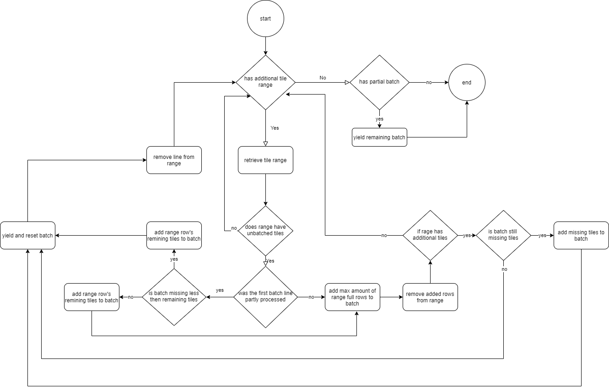

# Map Colonies raster tile synchronization batcher

----------------------------------

----------------------------------

this service create tiles synchronization tasks based on configured batch size.

## service configurations:
- general configurations:
   - `LOG_LEVEL` - agent minimum log level (must be valid nodejs log level).
   - `SERVER_PORT` - rest api listening port.
- batching configurations:
    - `BATCH_SIZE`: number of tiles required for each task.
- external services configurations:
    - `SERVICE_CLIENTS_CATALOG_URL`: url for the raster-catalog-manager service.
    - `SERVICE_CLIENTS_JOB_MANAGER_URL`: url for the job-manager service.
    - `SERVICE_CLIENTS_TASK_TYPE`: type for tasks this service will create
  -  http calls retries configurations:
     - `HTTP_RETRY_ATTEMPTS`: amount for retries for rest calls to external services.
     - `HTTP_RETRY_DELAY` - amount of delay between http retries in ms or `exponential` for exponential backoff.
     - `HTTP_RETRY_RESET_TIMEOUT` - defines if http time out should be rest for every attempt (true) or be cumulative (false).

## batching algorithm:

